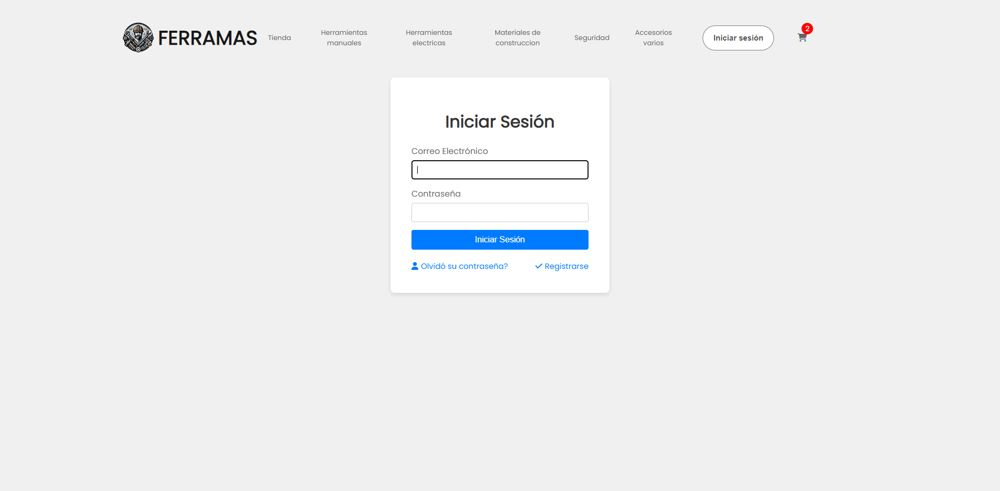

<h1 align="center">Ferramas Cart Shop</h1>
<p align="center"><i>Proyecto de digitalización de ventas para tienda de ferreteria.</i></p>
<br>

Este repositorio contiene el código del proyecto desarrollado durante el transcurso de la asignatura "Integración de plataformas" de Duoc UC.

## Tabla de contenidos
  - [Lenguajes](#Lenguajes)
  - [Tecnología](#Tecnología)
  - [Base de datos](#Base_de_datos)
  - [Arquitectura](#Arquitectura)
  - [Framework](#Framework)
  - [Pasos de implementación](#Pasos_de_implementación)

## Aplicación

Ferramas Cart Shop es una aplicación web diseñada para digitalizar el proceso de ventas de una tienda de ferretería. La aplicación permite a los clientes navegar por una tienda virtual, seleccionar productos y agregarlos a un carrito de compras, y realizar pagos en línea con Webpay Plus.

A continuación se mostrarán imagenes de la aplicación:

<h2>Página de inicio:</h2>


<h2>Login:</h2>

Vista del login:


Notificación después de haber inicado sesión:


Redirección a página de inicio con el nombre del usuario en el navbar, el carrito de compras se actualiza con los productos que el usuario haya agregado previamente:


<h2>Productos:</h2>

Vista de productos, se seleccionó "materiales de construcción" como ejemplo:


<h2>Carrito de compras:</h2>

Vista del carrito de compras:


Pago redireccionado a Webpay Plus:


Respuesta autorizada del pago de Webpay Plus:


## Lenguajes

El proyecto utiliza los siguientes lenguajes de programación:
- **JavaScript**: Para el desarrollo del frontend, utilizando React.
- **HTML**: Para estructurar el contenido web.
- **CSS/SCSS**: Para el diseño y estilo de la aplicación.
- **Node.js**: Para el desarrollo del backend.
- **SQL**: Para la gestión de la base de datos relacional.

# Tecnología

### Software Utilizado
- **Visual Studio Code**: Editor de código fuente desarrollado por Microsoft. Ofrece una gran variedad de herramientas, soporte y extensiones que permiten el desarrollo de código, incluyendo: soporte para depuración, control de versiones integrado, resaltado de sintaxis, finalización de código inteligente, fragmentos y refactorización de código.
- **PGAdmin**: Herramienta de administración y desarrollo de bases de datos para PostgreSQL.
- **GitHub**: Plataforma de hosting de repositorios de código que permite la colaboración y control de versiones utilizando Git.
  
### Frontend
- **React**: Librería desarrollada por Facebook para construir interfaces de usuario (UI).
- **React Router DOM**: Librería para manejar el enrutamiento en la aplicación.
- **Axios**: Cliente HTTP para realizar peticiones a la API.
- **React Toastify**: Librería para mostrar notificaciones.
- **SweetAlert2**: Librería para mostrar alertas.
- **FontAwesome**: Librería con Iconos.

### Backend
- **Node.js**: Entorno de ejecución para JavaScript en el servidor.
- **Express**: Framework para construir aplicaciones web y APIs.
- **Bcryptjs**: Librería para el hash de contraseñas.
- **Jsonwebtoken**: Implementación de JSON Web Tokens para la autenticación.
- **Cors**: Middleware para habilitar CORS.
- **Dotenv**: Librería para manejar variables de entorno.
- **Morgan**: Middleware para registrar solicitudes HTTP.
- **Node-fetch**: Librería para realizar peticiones HTTP.
- **Nodemailer**: Librería para el envío de correos electrónicos.
- **PG (node-postgres)**: Cliente para PostgreSQL.
- **Transbank SDK**: Librería para integrar pagos con Webpay.

### Herramientas de Desarrollo
- **Babel**: Compilador de JavaScript.
- **Jest**: Framework de pruebas para JavaScript.
- **Supertest**: Librería para probar APIs HTTP.
- **Fetch-mock**: Mocking de fetch para pruebas.
- **Nodemon**: Herramienta para reiniciar automáticamente el servidor.

## Base_de_datos

El proyecto utiliza PostgreSQL como sistema de gestión de bases de datos relacional. A continuación se describe su estructura de tablas y relaciones:

### Esquema de la Base de Datos


1. **users**: Esta tabla almacena la información de los usuarios registrados.
    - `user_id`: Identificador único del usuario.
    - `email`: Correo electrónico del usuario, debe ser único.
    - `password`: Contraseña encriptada del usuario.
    - `first_name`: Nombre del usuario.
    - `last_name`: Apellido del usuario.
    - `phone`: Número de teléfono del usuario.
    - `created_at`: Fecha y hora de creación del registro.
    - `updated_at`: Fecha y hora de última actualización del registro.

2. **categories**: Esta tabla almacena las categorías de los productos.
    - `category_id`: Identificador único de la categoría.
    - `name`: Nombre de la categoría.
    - `description`: Descripción de la categoría.

3. **products**: Esta tabla almacena los productos disponibles en la tienda.
    - `product_id`: Identificador único del producto.
    - `name`: Nombre del producto.
    - `description`: Descripción del producto.
    - `price`: Precio actual del producto.
    - `old_price`: Precio anterior del producto.
    - `category_id`: Identificador de la categoría a la que pertenece el producto.
    - `stock_quantity`: Cantidad de producto en stock.
    - `created_at`: Fecha y hora de creación del registro.
    - `updated_at`: Fecha y hora de última actualización del registro.
    - `image_path`: Ruta de la imagen del producto.

4. **orders**: Esta tabla almacena los pedidos realizados por los usuarios.
    - `order_id`: Identificador único del pedido.
    - `user_id`: Identificador del usuario que realizó el pedido.
    - `status`: Estado del pedido (por ejemplo, pendiente, completado).
    - `total_price`: Precio total del pedido.
    - `created_at`: Fecha y hora de creación del pedido.
    - `updated_at`: Fecha y hora de última actualización del pedido.

5. **order_details**: Esta tabla almacena los detalles de cada pedido.
    - `order_detail_id`: Identificador único del detalle del pedido.
    - `order_id`: Identificador del pedido.
    - `product_id`: Identificador del producto.
    - `quantity`: Cantidad de producto en el pedido.
    - `price_at_time_of_order`: Precio del producto en el momento del pedido.

6. **carts**: Esta tabla almacena la información de los carritos de compra de los usuarios.
    - `cart_id`: Identificador único del carrito.
    - `user_id`: Identificador del usuario que posee el carrito.
    - `created_at`: Fecha y hora de creación del carrito.
    - `updated_at`: Fecha y hora de última actualización del carrito.

7. **cart_items**: Esta tabla almacena los ítems de cada carrito de compra.
    - `cart_item_id`: Identificador único del ítem del carrito.
    - `cart_id`: Identificador del carrito.
    - `product_id`: Identificador del producto.
    - `quantity`: Cantidad de producto en el carrito.

8. **newsletter_subscribers**: Esta tabla almacena la información de los suscriptores del boletín.
    - `SubscriberID`: Identificador único del suscriptor.
    - `Email`: Correo electrónico del suscriptor.
    - `SubscribedAt`: Fecha y hora de suscripción.

9. **discounts**: Esta tabla almacena la información sobre los descuentos disponibles.
    - `id`: Identificador único del descuento.
    - `discount`: Porcentaje de descuento aplicado.

### Relación entre las tablas
- Un `user` puede tener múltiples `orders` (1:N) y múltiples `carts` (1:N).
- Un `order` puede tener múltiples `order_details` (1:N) y pertenece a un `user` (1:1).
- Un `product` pertenece a una `category` (1:1), puede pertenecer a múltiples `order_details` (1:N) y puede estar en múltiples `cart_items` (1:N).
- Un `cart` pertenece a un `user` (1:1) y puede tener múltiples `cart_items` (1:N).
- Un `cart_item` está asociado a un `product` (1:1) y pertenece a un `cart` (1:1).
- Una `category` puede estar asociada a múltiples `products` (1:N).
- Un `order_detail` pertenece a un `order` (1:1) y está asociada a un `product` (1:1).

## Arquitectura

El proyecto sigue una arquitectura de cliente-servidor de tres capas, que separa las responsabilidades en diferentes niveles:


### 1. Capa de Presentación (Frontend)
- **React**: Maneja las vistas de la aplicación, proporcionando una interfaz de usuario. Esta capa permite generar interacciones con el usuario y la presentación de los datos.

### 2. Capa de Lógica del Negocio (Backend)
- **Node.js y Express**: Gestionan la lógica del negocio a través de controladores que manejan las solicitudes HTTP, procesan los datos y aplican las reglas del negocio. Esta capa actúa como intermediaria entre la capa de presentación y la capa de datos, comunicándose con APIs externas y la base de datos interna según sea necesario.

### 3. Capa de Datos (Base de Datos)
- **PostgreSQL**: Almacena los datos de la aplicación. Las tablas y sus relaciones están definidas en la base de datos. Esta capa es responsable del almacenamiento, recuperación y gestión de los datos.


## Framework

### Frontend - React
React es una biblioteca de JavaScript desarrollada por Facebook, utilizada para construir interfaces de usuario. Permite la creación de componentes reutilizables que pueden manejar su propio estado, lo que facilita el desarrollo de aplicaciones web complejas y dinámicas. React utiliza un DOM virtual para optimizar la actualización de la interfaz de usuario, lo que mejora el rendimiento de la aplicación.

### Backend - Express
Express es un framework para Node.js, diseñado para construir aplicaciones web y APIs de manera sencilla y eficiente. Proporciona características para la gestión de solicitudes HTTP, middleware y enrutamiento, lo que permite el desarrollo de servidores y servicios web escalables y mantenibles. Express es altamente flexible y se integra bien con otros módulos y bibliotecas de Node.js.

## Pasos_de_implementación

### Configuración de la Base de Datos
1. Configura PostgreSQL y crea una base de datos para el proyecto.
2. Ejecuta el código dentro de `backend/database/db.sql` para crear las tablas e insertar los datos de productos, categorías y descuentos necesarios para el funcionamiento de la aplicación.

### Clonar el repositorio
1. Clona este repositorio en tu máquina local:
    ```bash
    git clone https://github.com/Mumoide/shopping-cart.git
    cd shopping-cart
    ```

### Configuración del Frontend
1. Navega al directorio del frontend:
    ```bash
    cd frontend
    ```
2. Instala las dependencias:
    ```bash
    npm install
    ```
3. Inicia la aplicación:
    ```bash
    npm start
    ```

### Configuración del Backend
1. Navega al directorio del backend:
    ```bash
    cd ../backend
    ```
3. Instala las dependencias:
    ```bash
    npm install
    ```
4. Crea un archivo `.env` en el directorio del backend con las variables de entorno necesarias, como las credenciales de la base de datos y las claves de API (puedes usar el archivo `.env.example` como guía).
5. Inicia el servidor en modo desarrollo:
    ```bash
    npm run dev
    ```


